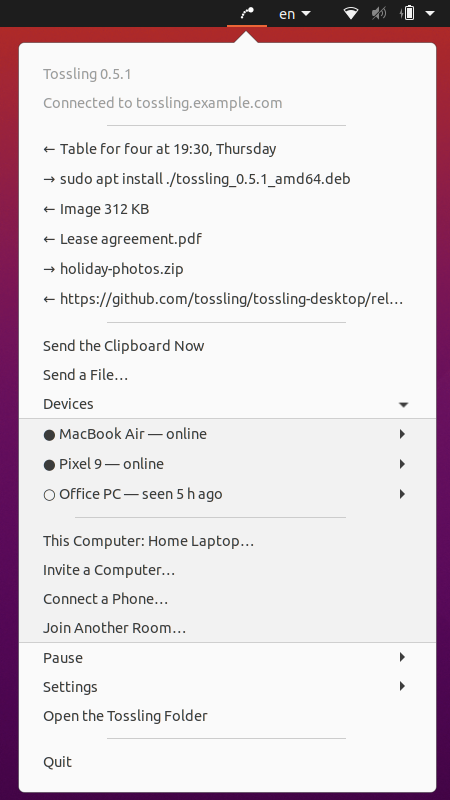

<p align="center">
  
</p>

<h1 align="center">Tossling Desktop</h1>

<p align="center">
  One clipboard for your computers and Android phone, through your own server.<br>
  Copy on one device and paste on another a second later. Everything is encrypted on the devices.
</p>

<p align="center">
  <a href="https://github.com/tossling/tossling-desktop/releases/latest"></a>
  
  
  
  
  <a href="LICENSE"></a>
</p>

<p align="center">
  
  &nbsp;&nbsp;
  
</p>

Copy on one computer and paste on another or on the phone. Files up to 500 MB go the same way. The server only
relays ciphertext.

This repository holds the desktop apps. On macOS it is a menu bar helper (`Tossling.app`) with the `tossling` command and
a Finder extension. On Windows and Linux it is a tray app, see [Windows and Linux](#windows-and-linux). The Android app
lives in [tossling/tossling-mobile](https://github.com/tossling/tossling-mobile) and the server in
[tossling/tossling-server](https://github.com/tossling/tossling-server). An iOS app is in progress.

Menus and messages follow the system language, English or Russian. `tossling language en|ru|auto` overrides it.

## What it does

- Text and images you copy reach the other devices of your room by themselves. If you prefer, they go only on a hotkey.
- Files and folders go when you ask. Use "Send via Tossling" in Finder, the hotkey, the menu bar or `tossling send`.
  Received files land in `~/Downloads/Tossling` and in the clipboard, so you can paste them in Finder.
- The menu bar keeps the last 30 items in both directions, the devices of the room, pause and settings.
- Screenshots can go to the phone the moment you take them.
- Notifications from your projects (servers, bots, CI) show up as macOS notifications and in the menu.
- Tossling never sends passwords marked by password managers or anything from Apple's Universal Clipboard.

## Requirements

- macOS 13 or newer, Windows 10 or newer (x64 or ARM), or Linux on x64 or arm64.
- A [Tossling Server](https://github.com/tossling/tossling-server) (one Docker container) and its address, for example
  `https://tossling.example.com`. Its setup page shows the address and the token.

## Install

For Windows and Linux see [Windows and Linux](#windows-and-linux).

On a Mac download `Tossling-<version>.dmg` from [Releases](https://github.com/tossling/tossling-desktop/releases), drag
`Tossling.app` to Applications and open it. Homebrew works too, `brew install --cask tossling/tap/tossling`. The app is
signed and notarized. On the first start it asks for the server address and the token, or for an invite code from
another Mac, and then shows a QR code for the phone. After that it lives in the menu bar.

Since 0.3 updates come by themselves. At start and once a day the app looks for a new version through Sparkle and
offers it in the menu, and "Check for Updates…" asks right away. Updates are signed with Tossling's update key and the
same Developer ID. Builds from source do not update this way.

The `tossling` command comes with the app. Homebrew puts it into its `bin`, otherwise the app links it as
`~/.local/bin/tossling` (add `~/.local/bin` to `PATH` if your shell does not have it). The old name `tossy` still works
as an alias.

Before 0.2 Tossling was called Tossy. If you already run Tossy or a Tossling built from source, just open the app. It
takes over the settings (`~/.config/tossy` moves to `~/.config/tossling`), the room and the history, and removes the old
helper with its Finder extension.

## Setup from source

This is for development or for running without the app. It needs the Xcode Command Line Tools
(`xcode-select --install`).

```bash
git clone https://github.com/tossling/tossling-desktop.git ~/Developer/tossling
make -C ~/Developer/tossling install           # puts tossling into ~/.local/bin
tossling setup https://tossling.example.com    # paste the token from the server's setup page
```

`setup` checks the server and the token, creates a room (an encrypted channel with its own key), builds and starts the
helper and shows a QR code for the phone. macOS may ask you to allow Tossling in Login Items & Extensions in the
General section of System Settings. `setup` opens that page and waits.

The token can also come from the environment, as in `TOSSLING_TOKEN=tk_… tossling setup https://tossling.example.com`.

## The phone

Install Tossling on the phone, tap "Pair with a Mac" and scan the QR code that `tossling setup` (or later
`tossling pair`) shows. The QR code carries the room key and the token, so do not share it or take a screenshot of it.

## Another Mac

On a Mac that is already in the room run `tossling invite`, or choose Devices, then Invite Another Mac in the menu bar.
It prints something like `tossling join tossling.example.com/ABCD-EFGH`. Run that on the new Mac within 10 minutes. The
invite is never stored on the server. The first Mac keeps sending it uncached while it waits, and the room key inside is
encrypted with the code (PBKDF2 and AES-GCM).

## On a completely different Mac

A short checklist for a Mac that has never seen Tossling.

1. Install `Tossling.app` from Releases or with `brew install --cask tossling/tap/tossling` and open it.
2. To share the room you already have, run `tossling invite` on a Mac in it (or use Devices, then Invite Another Mac in
   the menu bar). In the first-run window choose "Join another Mac's room" and enter that code. For a new room choose
   "Connect my server" and enter the address and the token from the server's setup page. The server panel can issue a
   new setup link.
3. Allow Tossling in Login Items when macOS asks, and allow notifications.
4. For the copy-and-send hotkey allow Tossling in Accessibility, in the Privacy & Security section of System Settings.
5. For "Send via Tossling" in Finder enable Tossling among the Finder extensions in Login Items & Extensions, in the
   General section of System Settings.
6. `tossling status` or the menu bar should say it is connected and list the other devices.

## Windows and Linux

<p align="center">
  
  &nbsp;&nbsp;
  
</p>

On Windows and Linux Tossling sits in the tray. It joins a room with an invite from another computer (Devices, then
Invite a Computer, or `tossling invite` on a Mac), or creates a room on your server and shows the QR code for the phone.
Text, images, files and folders (as a zip) go both ways, and passwords marked by password managers are skipped. Updates
come from a feed signed with the same Ed25519 key as the Mac appcast.

### Windows

`Tossling-<version>.msi` from [Releases](https://github.com/tossling/tossling-desktop/releases) installs for the current
user and needs no administrator rights. On Windows 11 for ARM take `Tossling-<version>-arm64.msi`, it runs natively
without x64 emulation. The installers are not signed yet (see [Code signing policy](#code-signing-policy)), so Windows
asks you to confirm the first start with More info and Run anyway.

Win+Shift+C copies the selection and sends it, or Ctrl+Alt+Shift+C when another app has taken the first one. Explorer
gets "Send via Tossling" for files and folders. Tossling adds a "Tossling" value to
`HKCU\Software\Microsoft\Windows\CurrentVersion\Run` to start at login (Settings, then Start with Windows) and the
"Send via Tossling" entry to `HKCU\Software\Classes\*\shell` and `Directory\shell`. Uninstalling in Settings, Apps
removes the app, the autostart and the Explorer entry. The room and the history stay in `%APPDATA%\Tossling` until you
delete them.

### Linux

`tossling_<version>_amd64.deb` (or `_arm64.deb` for ARM) installs into `/opt/tossling` with an entry in the applications
menu. It runs on Ubuntu 20.04 or newer, Debian, Mint and Pop!_OS, install it with
`sudo apt install ./tossling_<version>_amd64.deb`. `Tossling-<version>-linux-x64.tar.gz` (or `-linux-arm64.tar.gz`)
runs on any distribution without installing, start `Tossling/bin/Tossling`.

The icon goes to the panel as a StatusNotifierItem with a native menu. KDE, Xfce and Cinnamon show it as is. GNOME needs
the AppIndicator extension, which Ubuntu has built in. If the panel has no place for the icon, Tossling opens a window
that explains how to get one.

Tossling adds "Send via Tossling" to Nautilus and Caja (as a script), Nemo, Dolphin and Thunar, and starts at login
through `~/.config/autostart/tossling.desktop`. On X11 Super+Shift+C (or Ctrl+Alt+Shift+C) sends the selected text.
Wayland has no global shortcuts for apps, so bind `/opt/tossling/bin/Tossling --send-clipboard` to a key in the system
settings. On Wayland Tossling runs through XWayland and still sees what you copy. We checked this on Ubuntu 20.04 with
GNOME 3.36.

Installed from the `.deb`, Tossling offers new versions in the menu. It downloads the package, checks the same Ed25519
signature as on Windows and installs it through `pkexec`, which asks for your password. The `tar.gz` build only shows a
link to the release. After `apt remove` the autostart entry and the Nemo and Dolphin items disappear. The Nautilus, Caja
and Thunar items stay until the first click, which deletes all of them.

## Everyday use

| Command | What it does |
|---|---|
| `tossling` | a menu of actions in the terminal |
| `tossling status` | connection, devices in the room, what was sent and received |
| `tossling send <file or text>` | sends to every device. `--to <name>` sends to one, `--pick` asks in a window, `… \| tossling send` sends piped text |
| `tossling pause [min]` / `tossling resume` | stops sending this Mac's clipboard for a while, receiving goes on |
| `tossling auto on\|off` | sends copied text and images by themselves, or only on the hotkey |
| `tossling hotkey on\|off` | the hotkey (⌃⌥⌘C or ⇧⌘C, chosen in the menu) copies the selection and sends it |
| `tossling images on\|off` | sends images too, or text only |
| `tossling rename <name>` | renames this Mac for the whole room. `tossling rename <device> <name>` names another device on this Mac only |
| `tossling pair [--new]` | a QR code for a phone. `--new` starts a new room |
| `tossling invite` / `tossling join <code>` | adds another Mac |
| `tossling log` | what was sent and why something was skipped |
| `tossling on` / `off` / `remove` | starts, stops, or removes the helper and its settings |
| `tossling project [list]` | projects of the server and their publishers |
| `tossling project add <channel> [name] [--publisher <name>]` | a new project on a Tossling Server. Prints the publisher token once with a `curl` example |
| `tossling project remove <channel>` | deletes a project, and its token stops working |
| `tossling language en\|ru\|auto` | the language of menus and messages |
| `tossling config --json` | server, token and project channels for other programs |

## Security

- Content is encrypted with AES-256-GCM on the devices. Short text travels in the message itself. Longer text, images
  and files travel as attachments encrypted in 1 MiB chunks (the TSY2 format), so large files are never read into memory.
- Every device has its own X25519 key pair. When you disconnect a device, the rest of the room moves to a new channel
  and a new key, sealed for each remaining device (X25519, HKDF-SHA256 and AES-GCM), and to a new server token. The old
  token is deleted after a day.
- The server never sees the clipboard. It knows which room channels are used and when.
- Some things are never sent by themselves. These are items password managers mark as concealed
  (`org.nspasteboard.ConcealedType` and friends), Apple's Universal Clipboard (`com.apple.is-remote-clipboard`), files
  copied in Finder, text over 1 MB and whatever arrived from another device a minute ago. Text and images older than 15
  minutes (say, the Mac was asleep) do not go into the clipboard. Files are accepted for 3 hours, as long as the server
  keeps attachments.

## Troubleshooting

### Nothing arrives

`tossling status` shows whether the helper is connected, and `tossling log` shows what it did and why it skipped
something. A paused Mac does not send but still receives.

### What I copy on an iPhone or iPad does not reach the phone

Tossling ignores Apple's Universal Clipboard on purpose and does not wake it. Copy on a device that runs Tossling.

### The hotkey does nothing

Allow Tossling in Accessibility, in the Privacy & Security section of System Settings. With an Apple Development
certificate the permission survives rebuilds. With an ad-hoc signature macOS may ask again after an update. After
switching from a source build to the app, remove the old Tossling from that list with "−" and enable the new one. The
old entry looks enabled but no longer matches.

⇧⌘C is also taken by Chrome, Finder, Android Studio and Xcode, so the default is ⌃⌥⌘C.

### No "Send via Tossling" in Finder

Enable the Tossling Finder extension, see the checklist above. If a source install cannot build the extension,
Tossling installs Quick Actions with the same name instead.

### No notifications

Allow notifications for Tossling in the Notifications section of System Settings.

### The helper does not start after login

Allow it in Login Items & Extensions and run `tossling on`.

## Files

| Path | What is there |
|---|---|
| `~/.config/tossling/config.json` | settings, room key and token (mode 600) |
| `~/.cache/tossling/` | state, history, the device list for Finder |
| `~/Library/Logs/Tossling.log` | the helper's log |
| `/Applications/Tossling.app` | the installed app with the helper, the Finder extension and the `tossling` command inside |
| `~/Applications/Tossling.app` | a source install of the helper, built from `mac/Tossling` |
| `~/Library/Application Support/Tossling/Tossling Finder.app` | a source install of the Finder extension, built from `mac/TosslingFinder` |

Both kinds of install share the settings and the history. Use one of them on a Mac. Opening the app removes a source
install. To go back to the source, run `tossling off`, delete the app, then run `make install` and `tossling on`.

## Development

```bash
make test     # Python and Swift checks (Xcode and the Command Line Tools), crypto vectors, CLI tests
make build    # Tossling.app and Tossling Finder.app into build/ without installing
make app      # the self-contained Tossling.app into build/release (universal, Finder extension inside)
make release  # the same, signed with Developer ID, notarized, in a notarized disk image, plus a Homebrew cask and the appcast
make publish NOTES=notes.md  # tag, GitHub release, cask in tossling/homebrew-tap, appcast and feeds on monoroh.com/tossling
```

`make app` downloads Sparkle (pinned version and checksum) into `build/cache`. A release needs the Sparkle key in the
login keychain (`generate_keys --account tossling`). Its public half is `SPARKLE_PUBLIC_KEY` in `scripts/build_app.py`.
Keep a copy of the private key (`generate_keys --account tossling -x <file>`), because without it installed apps cannot
be updated.

When `/Applications/Tossling.app` is installed, a source `tossling` hands every command to the app's own copy, so the
two never fight over the helper. Set `TOSSLING_FROM_SOURCE=1` to run the source copy anyway.

`cli/` is the `tossling` command (Python from macOS), `mac/Tossling` the helper, `mac/TosslingFinder` the Finder
extension. The protocol is described in
[PROTOCOL.md](https://github.com/tossling/tossling-server/blob/main/docs/PROTOCOL.md) in the server repository.
`mac/Tossling/vectors.json` is a copy of its `docs/vectors.json`, the same file tossling-mobile tests against, and
`make selftest` checks the Mac code with it. CLI tests run on a temporary `HOME` and never touch the running helper.

### The Windows and Linux app

`jvm/` is the app for Windows and Linux, written in Kotlin with Compose Desktop. Every push builds the MSIs for x64 and
ARM, the `.deb` packages and the `tar.gz` archives in the "Windows and Linux" workflow. `make publish` adds them to the
release and updates the Windows and Linux feeds.

The protocol module comes from tossling-mobile, a git submodule in `jvm/external/tossling-mobile`.

```bash
git submodule update --init
cd jvm
./gradlew :app:run           # runs on macOS and Linux too, with its data in a separate folder
./gradlew :app:test          # the live test runs only when TOSSLING_IT_INVITE points at a local server and invite
```

To work on the protocol and the app together, put `tossling.mobile=../../tossling-mobile` into `jvm/local.properties`.

## Code signing policy

The Windows installers are not code-signed yet, so Windows asks to confirm the first start. They are built from this
repository by the "Windows and Linux" workflow on a version tag. Updates on Windows and Linux are installed only after
their Ed25519 signature checks out against the key built into the app.

Committers, reviewers and release approvers: [kopylovis](https://github.com/kopylovis).

Tossling sends data only where you point it. The clipboard goes, encrypted on the device, to the Tossling Server of
your room, which you choose at setup. The app also checks for updates. The Mac reads the Sparkle appcast, Windows and
Linux read feeds like `https://monoroh.com/tossling/windows.json`, and new versions download from GitHub Releases.
Nothing else is sent, and there is no analytics or telemetry.

## Reporting a vulnerability

See [SECURITY.md](SECURITY.md).

## License

GPL-3.0, see LICENSE.
