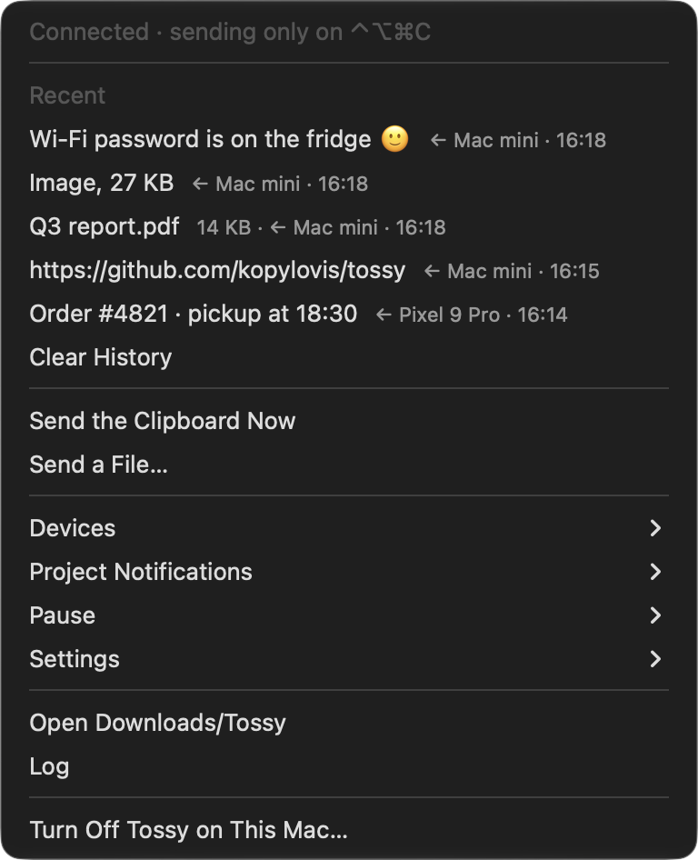
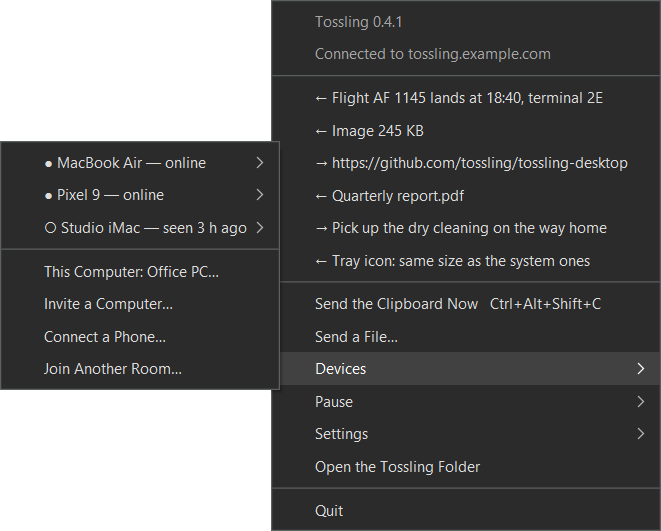

<p align="center">
  
</p>

<h1 align="center">Tossling Desktop</h1>

<p align="center">
  One clipboard for your Macs and Android phone, through your own server.<br>
  Copy on one device, paste on another a second later. Everything is encrypted on the devices.
</p>

<p align="center">
  <a href="https://github.com/tossling/tossling-desktop/releases/latest"></a>
  
  
  
  <a href="LICENSE"></a>
</p>

<p align="center">
  
  &nbsp;&nbsp;
  
</p>

Copy on one computer and paste on another or on the phone; files up to 500 MB go the same way. The server only
relays ciphertext.

This repository is the desktop side: for macOS a menu bar helper (`Tossling.app`), the `tossling` command and a
Finder extension, for Windows a tray app ([Windows](#windows-and-linux)). **Linux is in progress** and will live here too.
The phone app lives in [tossling/tossling-mobile](https://github.com/tossling/tossling-mobile), the server in
[tossling/tossling-server](https://github.com/tossling/tossling-server).

Menus and messages follow the system language (English or Russian); `tossling language en|ru|auto` overrides it.

## What it does

- Text and images you copy reach the other devices of your room by themselves (or only on a hotkey, if you prefer).
- Files and folders go when you ask: the Finder menu «Send via Tossling», the hotkey, the menu bar or `tossling send`.
  Received files land in `~/Downloads/Tossling` and in the clipboard, so you can paste them in Finder.
- The menu bar keeps the last 30 items in both directions, the devices of the room, pause and settings.
- Optionally, screenshots go to the phone the moment you take them.
- Notifications from your projects (servers, bots, CI) show up as macOS notifications and in the menu.
- Passwords marked by password managers and Apple's Universal Clipboard are never sent.

## Requirements

- macOS 13 or newer.
- A [Tossling Server](https://github.com/tossling/tossling-server) (one Docker container) and its address, for example
  `https://tossling.example.com`. Its setup page shows the address and the token.

## Install

Download `Tossling-<version>.dmg` from [Releases](https://github.com/tossling/tossling-desktop/releases), drag `Tossling.app` to
Applications and open it (or `brew install --cask tossling/tap/tossling`). The app is signed and notarized. On the first
start it asks for the server address and the token, or for an invite code from another Mac, then shows a QR code for
the phone. It lives in the menu bar afterwards.

Updates come by themselves since 0.3: at start and once a day the app looks for a new version (Sparkle, the update is signed with
Tossling's update key and with the same Developer ID) and offers it in the menu; «Check for Updates…» asks right away.
Builds from source are not updated this way.

The `tossling` command comes with the app: Homebrew puts it into its `bin`, otherwise the app links it as
`~/.local/bin/tossling` (add `~/.local/bin` to `PATH` if your shell does not have it). The old name `tossy` keeps
working as an alias.

Tossling was called Tossy before 0.2. Already running Tossy, or Tossling built from source? Just open the app: it takes
over the settings (`~/.config/tossy` moves to `~/.config/tossling`), the
room and the history, and removes the old helper and its Finder extension.

## Setup from source

For development, or without the app; needs the Xcode Command Line Tools (`xcode-select --install`).

```bash
git clone https://github.com/tossling/tossling-desktop.git ~/Developer/tossling
make -C ~/Developer/tossling install        # puts tossling into ~/.local/bin
tossling setup https://tossling.example.com    # paste the token from the server's setup page
```

`setup` checks the server and the token, creates a room (an encrypted channel with its own key), builds and starts
the helper and shows a QR code for the phone. macOS may ask to allow Tossling in
System Settings → General → Login Items & Extensions; `setup` opens that page and waits.

The token can also come from the environment: `TOSSLING_TOKEN=tk_… tossling setup https://tossling.example.com`.

## The phone

Install Tossling on the phone, tap «Pair with a Mac» and scan the QR code that `tossling setup` (or later `tossling pair`)
shows. The QR code carries the room key and the token: do not share it or take a screenshot of it.

## Another Mac

On a Mac that is already in the room run `tossling invite` (or menu bar → Devices → Invite another Mac). It prints
`tossling join tossling.example.com/ABCD-EFGH`; run that on the new Mac within 10 minutes. The invite is never stored on
the server: the first Mac keeps sending it uncached while it waits, and the room key inside is encrypted with the
code (PBKDF2 + AES-GCM).

## On a completely different Mac

A short checklist for a Mac that has never seen Tossling:

1. Install `Tossling.app` (Releases or `brew install --cask tossling/tap/tossling`) and open it.
2. To share the room you already have, run `tossling invite` on a Mac in it (or menu bar → Devices → Invite Another
   Mac) and choose «Join another Mac's room» in the first-run window with that code. For a new room choose «Connect my
   server» with the address and the token from the server's setup page (its panel can issue a new setup link).
3. Allow Tossling in Login Items when macOS asks, and allow notifications.
4. For the copy-and-send hotkey allow Tossling in System Settings → Privacy & Security → Accessibility.
5. For «Send via Tossling» in Finder enable Tossling among the Finder extensions in System Settings → General →
   Login Items & Extensions.
6. `tossling status` (or the menu bar) should say it is connected and list the other devices.

## Everyday use

| | |
|---|---|
| `tossling` | a menu of actions in the terminal |
| `tossling status` | connection, devices in the room, what was sent and received |
| `tossling send <file or text>` | send to every device; `--to <name>` to one, `--pick` asks in a window; also `… \| tossling send` |
| `tossling pause [min]` / `tossling resume` | stop sending this Mac's clipboard for a while (receiving goes on) |
| `tossling auto on\|off` | send copied text and images by themselves, or only on the hotkey |
| `tossling hotkey on\|off` | the hotkey (⌃⌥⌘C or ⇧⌘C, chosen in the menu) copies the selection and sends it |
| `tossling images on\|off` | send images or text only |
| `tossling rename <name>` | rename this Mac for the whole room; `tossling rename <device> <name>` names another device on this Mac only |
| `tossling pair [--new]` | QR code for a phone; `--new` starts a new room |
| `tossling invite` / `tossling join <code>` | add another Mac |
| `tossling log` | what was sent and why something was skipped |
| `tossling on` / `off` / `remove` | start, stop, or remove the helper and its settings |
| `tossling project [list]` | projects of the server and their publishers |
| `tossling project add <channel> [name] [--publisher <name>]` | a new project on a Tossling Server; prints the publisher token once with a `curl` example |
| `tossling project remove <channel>` | delete a project; its token stops working |
| `tossling language en\|ru\|auto` | the language of menus and messages |
| `tossling config --json` | server, token and project channels for other programs |

## Security

- Content is encrypted with AES-256-GCM on the devices. Short text travels in the message, longer text, images and
  files as attachments encrypted in 1 MiB chunks (the TSY2 format), so large files are never read into memory.
- Every device has its own X25519 key pair. Disconnecting a device moves the rest of the room to a new channel and a
  new key, sealed for each remaining device (X25519 + HKDF-SHA256 + AES-GCM), and to a new server token; the old token
  is deleted after a day.
- The server never sees the clipboard. It knows which room channels are used and when.
- Not sent by themselves: items password managers mark as concealed (`org.nspasteboard.ConcealedType` and friends),
  Apple's Universal Clipboard (`com.apple.is-remote-clipboard`), files copied in Finder, text over 1 MB and what
  arrived from another device a minute ago. Text and images older than 15 minutes (the Mac was asleep) are not put
  into the clipboard; files are accepted for 3 hours, as long as the server keeps attachments.

## Troubleshooting

- **Nothing arrives.** `tossling status` shows whether the helper is connected; `tossling log` shows what it did and why it
  skipped something. A paused Mac does not send but still receives.
- **What I copy on an iPhone or iPad does not reach the phone.** Tossling ignores Apple's Universal Clipboard on purpose
  and does not wake it: copy on a device that runs Tossling.
- **The hotkey does nothing.** Allow Tossling in Privacy & Security → Accessibility. With an Apple Development
  certificate the permission survives rebuilds; with an ad-hoc signature macOS may ask again after an update. After
  switching from a source build to the app, remove the old Tossling from that list with «−» and enable the new one: the
  old entry looks enabled but no longer matches.
  ⇧⌘C is also used by Chrome, Finder, Android Studio and Xcode, so ⌃⌥⌘C is the default.
- **No «Send via Tossling» in Finder.** Enable the Tossling Finder extension (see the checklist). If a source install cannot
  build the extension, Tossling installs Quick Actions with the same name instead.
- **No notifications.** Allow notifications for Tossling in System Settings → Notifications.
- **The helper does not start after login.** Allow it in Login Items & Extensions and run `tossling on`.

## Files

| | |
|---|---|
| `~/.config/tossling/config.json` | settings, room key and token (mode 600) |
| `~/.cache/tossling/` | state, history, the device list for Finder |
| `~/Library/Logs/Tossling.log` | the helper's log |
| `/Applications/Tossling.app` | the installed app: helper, Finder extension and the `tossling` command inside |
| `~/Applications/Tossling.app` | a source install: the helper, built from `mac/Tossling` |
| `~/Library/Application Support/Tossling/Tossling Finder.app` | a source install: the Finder extension, built from `mac/TosslingFinder` |

Settings and history are the same for both kinds of install. Use one of them on a Mac: opening the app removes a
source install; to go back to the source, run `tossling off`, delete the app, then `make install` and `tossling on`.

## Development

```bash
make test     # Python and Swift checks (Xcode and the Command Line Tools), crypto vectors, CLI tests
make build    # Tossling.app and Tossling Finder.app into build/ without installing
make app      # the self-contained Tossling.app into build/release (universal, Finder extension inside)
make release  # the same, signed with Developer ID, notarized, in a notarized disk image, plus a Homebrew cask and the appcast
make publish NOTES=notes.md  # tag, GitHub release, cask in tossling/homebrew-tap, appcast on monoroh.com/tossling
```

`make app` downloads Sparkle (pinned version and checksum) into `build/cache`. A release needs the Sparkle key in the
login keychain (`generate_keys --account tossling`); its public half is `SPARKLE_PUBLIC_KEY` in `scripts/build_app.py`. Keep a copy of the private key (`generate_keys --account tossling -x <file>`): without it, installed apps cannot be updated.

When `/Applications/Tossling.app` is installed, a source `tossling` hands every command to the app's own copy, so the two
never fight over the helper; set `TOSSLING_FROM_SOURCE=1` to run the source copy anyway.

`cli/` is the `tossling` command (Python from macOS), `mac/Tossling` the helper, `mac/TosslingFinder` the Finder extension.
The protocol is described in [PROTOCOL.md](https://github.com/tossling/tossling-server/blob/main/docs/PROTOCOL.md) in
the server repository. `mac/Tossling/vectors.json` is a copy of its `docs/vectors.json`, the same file tossling-mobile
tests against; `make selftest` checks the Mac code with it. CLI tests run on a temporary `HOME` and never touch the running helper.

### Windows and Linux

<p align="center">
  
</p>

`jvm/` is the app for Windows and Linux: Kotlin with Compose Desktop, sitting in the tray. It joins a room with
an invite from another computer (Devices → Invite a Computer, or `tossling invite` on a Mac), or creates a room on your
server and shows the QR code for the phone. Text, images, files and folders (as a zip) go both ways; passwords marked by
password managers are skipped. Win+Shift+C copies the selection and sends it, and Explorer gets «Send via Tossling»
for files and folders. Updates come from a feed signed with the same Ed25519 key as the Mac appcast.

What it changes in the system: a «Tossling» value in `HKCU\Software\Microsoft\Windows\CurrentVersion\Run` to start at
login (Settings → Start with Windows), the «Send via Tossling» entry in `HKCU\Software\Classes\*\shell` and
`Directory\shell`, and the global Win+Shift+C (Ctrl+Alt+Shift+C when it is taken). Uninstalling in Settings → Apps removes
the app, the autostart and the Explorer entry; the room and history stay in `%APPDATA%\Tossling` until you delete them.

`Tossling-<version>.msi` in [Releases](https://github.com/tossling/tossling-desktop/releases) installs for the current
user, no administrator rights needed. Until the installers are signed (see [Code signing policy](#code-signing-policy)),
Windows asks to confirm the first start (More info → Run anyway). Every push builds the MSI in the «Windows and Linux»
workflow; `make publish` adds it to the release and updates the Windows feed.

On Linux `tossling_<version>_amd64.deb` (or `_arm64.deb` for ARM) installs into `/opt/tossling` with an entry in the
applications menu (Ubuntu 20.04 or newer, Debian, Mint, Pop!_OS: `sudo apt install ./tossling_<version>_amd64.deb`), and
`Tossling-<version>-linux-x64.tar.gz` (`-linux-arm64.tar.gz`) runs on any distribution without installing
(`Tossling/bin/Tossling`). Without a place for the icon in the panel Tossling opens a window that says how to get one.
The icon goes to the panel as a StatusNotifierItem with a native menu: KDE, Xfce and Cinnamon show it as is, GNOME needs
the AppIndicator extension, which Ubuntu has built in. Tossling adds «Send via Tossling» to Nautilus and Caja (Scripts),
Nemo, Dolphin and Thunar, starts at login through `~/.config/autostart/tossling.desktop`, and on X11 Super+Shift+C
(Ctrl+Alt+Shift+C when it is taken) sends the selected text. Wayland has no global shortcuts for apps: bind
`/opt/tossling/bin/Tossling --send-clipboard` to a key in the system settings. On Wayland Tossling runs through XWayland
and still sees what you copy (checked on Ubuntu 20.04 with GNOME 3.36). There are no automatic updates on Linux yet:
install the new `.deb` from Releases over the old one.

The protocol module comes from tossling-mobile, a git submodule in `jvm/external/tossling-mobile`:

```bash
git submodule update --init
cd jvm
./gradlew :app:run           # runs on macOS and Linux too, with its data in a separate folder
./gradlew :app:test          # the live test runs only when TOSSLING_IT_INVITE points at a local server and invite
```

To work on the protocol and the app together, put `tossling.mobile=../../tossling-mobile` into `jvm/local.properties`.

## Code signing policy

Windows releases are signed with free code signing provided by [SignPath.io](https://about.signpath.io), certificate by
[SignPath Foundation](https://signpath.org). The installer is built from this repository by the «Windows and Linux»
workflow on a version tag, and every signing request is approved by hand.

- Committers and reviewers: [kopylovis](https://github.com/kopylovis)
- Approvers: [kopylovis](https://github.com/kopylovis)

Privacy: Tossling sends data only where you point it. The clipboard goes, encrypted on the device, to the ntfy server of
your room, which you choose when you set it up. The app also checks for updates: the Mac at the Sparkle appcast, Windows
at `https://monoroh.com/tossling/windows.json`, downloading new versions from GitHub Releases. Nothing else is sent, there
is no analytics or telemetry.

## Reporting a vulnerability

See [SECURITY.md](SECURITY.md).

## License

GPL-3.0, see LICENSE.
